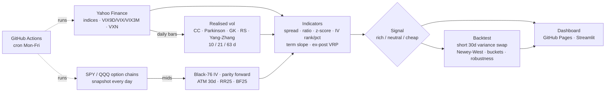

# Implied vs Realised Volatility Monitor

**Is volatility expensive today?** A daily tool that compares implied volatility (what the
market prices) with realised volatility (what actually happens), tracks the VIX term
structure and option-chain skew, and flags when vol is *rich* or *cheap*. The gap between
the two — the **variance risk premium** — is the core P&L driver of vol selling and of
structured-product pricing (every autocall / reverse convertible is, economically, a short
vol position).

The signal is then **tested honestly**: does a rich spread actually precede a winning vol
sale? Negative and fragile results are reported, not hidden.



## Key results (S&P 500 / VIX, 1999–2018, reproducible offline)

Trade proxy: sell a 30-day variance swap at the close, struck at the VIX, settled on the
realised variance of the next 21 sessions. P&L per unit of vega notional, in vol points,
0.5 pt cost per trade. `python scripts/offline_study.py` reproduces everything below.

| | Value |
|---|---|
| Average VIX vs average 21d realised vol | 19.9 % vs 16.4 % |
| Ex-post VRP (IV − future RV) | **+3.6 vol pts** on average, positive **84 %** of the time |
| Always sell variance (monthly, non-overlapping) | +2.0 pts/trade, hit rate 83 %, **worst trade −75 pts**, Sharpe 0.93 |
| Sell only when "rich" (z > 1) | +2.9 pts/trade, worst trade −7 pts, max drawdown −18 vs −114, Sharpe 0.78 (flat 85 % of the time) |

**What the signal does and does not do**

- **Quintiles of the spread z-score are close to monotonic:** mean forward P&L rises from
  1.2 pts (Q1) to 2.7 pts (Q5), and the worst loss shrinks from −87 to −38 pts. A rich
  spread mostly buys *tail protection*, more than extra carry.
- **The excess over neutral days is fragile:** +1.06 pts at z > 1 (Newey-West t = 1.85,
  not significant at 5 %). It strengthens with stricter thresholds (z > 2: +2.5 pts,
  t = 2.6) consistently across 6-, 12- and 24-month z-score windows.
- **It is regime-dependent (negative result):** zero excess in 1999–2007 (t = 0.0),
  strong in 2008–2012 (t = 2.5), weak in 2013–2018 (t = 0.9).
- **The "cheap" leg does not work without the term-structure filter (negative result):**
  in 2013–2018, "cheap" days were actually *better* days to sell vol (t = +2.4, wrong
  sign). Spikes in realised vol above implied tend to mean-revert.
- The term-structure filter (contango / backwardation) is not testable on this offline
  source (no VIX3M); the daily job tests the full rule on Yahoo data from 2006.

**Data quality finding.** 40 % of Yahoo `^GSPC` opens over 1999–2018 are a copy of the
previous close (96 % before 2006, 0 % after 2014). This silently kills the overnight term
of Yang-Zhang and biases range estimators. The monitor measures it and automatically falls
back to close-to-close (`indicators.choose_rv`). On clean data (2014–2018), Yang-Zhang has
the lowest RMSE against future realised vol (5.76 pts vs 6.17 for close-to-close), while
Parkinson / Garman-Klass sit ~2 pts below close-to-close because they ignore the overnight gap.

Interactive version of the study: `docs/study_spx_1999_2018.html`.

### Full rule on live Yahoo data (2006–2026, z-score + VIX3M contango filter)

First production run, 5 Oct 2026. Same trade, same cost; sample starts with VIX3M (July 2006)
and therefore includes 2008, 2020 and every later stress episode.

| | Always sell | Sell only when "rich" |
|---|---|---|
| Monthly trades | 242 | 19 |
| P&L per trade (vol pts) | +0.9 | +3.4 |
| Worst daily-entry trade | **−253** (March 2020) | **−13** |
| Max drawdown (monthly roll) | −220 | −7 |
| Annualised Sharpe | 0.19 | 0.64 |

- "Rich" days add **+1.6 pts** over neutral days (Newey-West t = 1.9): same sign and size
  as the offline study, still short of 5 % significance.
- With the backwardation filter the "cheap" leg now has the expected sign (−4.4 pts), but
  it rests on 153 days clustered in a handful of episodes (t = −0.8) and flips sign in
  several sub-periods: **not a usable signal**.
- `^V2TX` (VSTOXX) returns no data on Yahoo, so implied vol for Europe is not covered;
  Euro Stoxx 50 realised vol is still computed. Scope: S&P 500 and Nasdaq-100.

## Methodology

**Realised vol** (`estimators.py`), annualised with 252 days, rolling 10 / 21 / 63 days,
strictly backward-looking (unit-tested for look-ahead):

| Estimator | Uses | Captures overnight gap | Comment |
|---|---|---|---|
| Close-to-close | C | yes | unbiased, noisy |
| Parkinson | H, L | no | ~5× more efficient, biased down by discrete sampling |
| Garman-Klass | O, H, L, C | no | assumes zero drift |
| Rogers-Satchell | O, H, L, C | no | drift-independent |
| Yang-Zhang | O, H, L, C, prev C | **yes** | min-variance mix of overnight, open-to-close and RS; needs genuine opens |

The tests simulate GBM paths with a 25 % overnight variance share and check each
estimator recovers σ (or σ·√0.75 for the range estimators, as theory predicts).

**Implied vol** (`implied.py`): quotes cleaned (bid > 0, spread < 50 % of mid); forward
per expiry backed out from put-call parity, so no dividend assumption; Black-76 inverted
on OTM mids; ATM vol interpolated in log-moneyness; 25-delta call / put vols interpolated
in forward delta; **RR25** = IV(25Δ call) − IV(25Δ put), **BF25** = average wing − ATM;
30-day constant maturity by linear interpolation in total variance σ²T (as the VIX does).
Yahoo's own `impliedVolatility` field is stored but not used.

**Indicators** (`indicators.py`): spread IV − RV and ratio IV / RV; 1-year z-score of the
spread; IV rank `(IV − min)/(max − min)` and IV percentile over one year; term-structure
slope VIX3M − VIX, ratios VIX/VIX3M and VIX9D/VIX; ex-post VRP `IV² − RV²(t→t+21)` with
the zero-mean variance-swap convention (evaluation only, never fed to the signal).

**Signal:** *rich* if spread z > +1 **and** contango; *cheap* if z < −1 **and**
backwardation; neutral otherwise. Threshold, window and filter are parameters.

**Signal test** (`backtest.py`): conditional P&L by state with Newey-West standard errors
(lag 20, overlapping daily trades) and a non-overlapping monthly sample; regression of P&L
on rich / cheap dummies (the question is *excess over always selling*, not whether short
vol earns a premium — it does); quintile analysis; robustness grid over thresholds and
z-score windows; sub-period stability.

**Limitations.** The VIX is not tradeable: real variance swaps strike above it (jump and
discretisation convexity) and carry a bid-offer, approximated by the cost. Variance-swap
P&L is a proxy for a delta-hedged straddle, not identical to it. Thresholds were not
optimised, but the sub-period table shows the edge is not stable over time.

## Data plan

| Need | Source | Status |
|---|---|---|
| VIX, VIX9D, VIX3M, VIX6M, VVIX, VXN | yfinance | daily |
| VSTOXX (`^V2TX`) | yfinance | checked by `scripts/check_sources.py` — if missing or stale, the Europe line is dropped and flagged |
| Index OHLC (S&P 500, Nasdaq-100, Euro Stoxx 50, CAC 40) | yfinance | daily, quality-checked |
| Option chains SPY, QQQ | yfinance, snapshotted daily | free history of Euro Stoxx / CAC option chains is practically unavailable, hence US chains |
| Offline study | `arch` bundled S&P 500 (1999–2018) + CBOE VIX via `datasets/finance-vix` | reproducible without Yahoo |

## Run it

```bash
pip install -r requirements.txt
pytest -q                          # 26 tests, offline
python scripts/offline_study.py    # reproduces the results above
python scripts/check_sources.py    # which series does Yahoo serve today?
python scripts/daily.py            # history + option snapshots + monitors + docs/index.html
streamlit run app.py               # interactive dashboard
```

**Automation:** `.github/workflows/daily.yml` runs Monday–Friday at 19:20 UTC (during the
US session, so option quotes are live), runs the tests, snapshots the chains, rebuilds the
monitors and commits `data/` and `docs/`. Enable GitHub Pages on `docs/` to publish the
dashboard.

```
src/volmon/
  estimators.py   realised vol estimators + data-quality checks
  implied.py      Black-76, parity forward, smile metrics, constant maturity
  indicators.py   spread, z-score, IV rank/percentile, term structure, signal
  backtest.py     short-variance P&L, Newey-West, buckets, robustness, strategies
  data.py         yfinance history, option snapshots, source check
  pipeline.py     daily job
  report.py       static Plotly dashboard
scripts/          daily.py · check_sources.py · offline_study.py
tests/            estimators · implied vol · indicators/backtest · end-to-end (Yahoo mocked)
```

*Analytical tool, not investment advice.*
